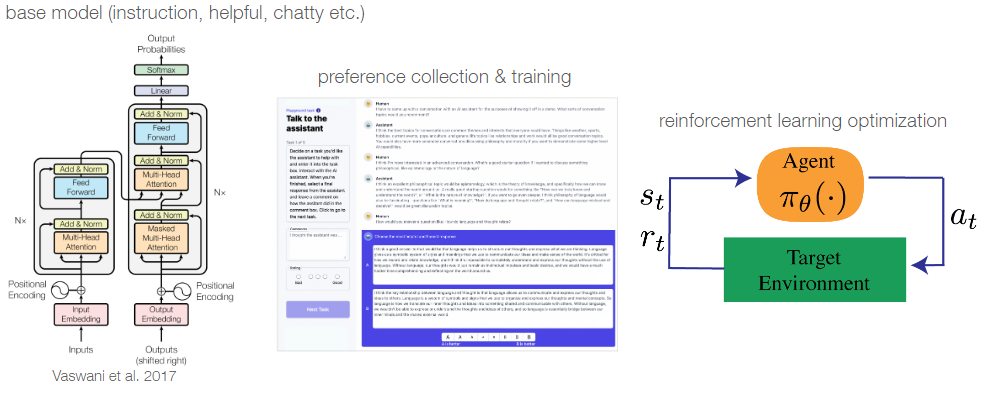
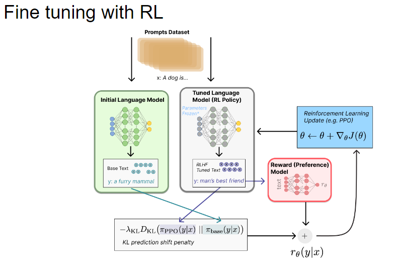

# Enhancing Large Language Models with Human Feedback


```
    ├── assets                      # Illustrations for Report / README
    ├── RLHF.ipynb                  # Training of the Reward Model and PPO Optimization Notebook
    ├── generated-outputs-ppo.txt   # Generated outputs from the optimized language model       
    ├── README.md              
    └── REPORT.md                   # Comprehensive Report
```

Part of the M2 Course "Mathematics of Machine and Deep learning Algorithms".

## Overview 
This GitHub repository explores Transformers and incorporates Reinforcement Learning with Human Feedback (RLHF), focusing on its application to fine-tune Large Language Models (LLMs) using Proximal Policy Optimization (PPO).
This project demonstrates the effectiveness of combining Reinforcement Learning with Human Feedback and PPO to enhance Large Language Models. By aligning AI behavior with human preferences, this approach contributes to the development of more reliable and user-friendly AI systems.

## Methodology

- **Reward Model Training**: A reward model is trained to predict human preferences by evaluating the quality of responses generated by the language model (GPT-2). This model is fine-tuned using human feedback to accurately represent human preferences.

- **Proximal Policy Optimization (PPO)**: Utilizing the trained reward model, PPO (a reinforcement learning algorithm) is employed to adjust the language model's policy. This optimization aligns the model's outputs with human preferences, enhancing its performance in generating desirable responses.

## Findings 

**Reward Model Training**: 

*RLHF steps*



*Results with 1 epoch, 1242 training points*
- Training Loss = **0.82**
- Validation Loss = **0.69**
- Accuracy = **0.51**

**Proximal Policy Optimization (PPO)** : Architecture and generated outputs



Mean Reward and KL divergence computed.

### Example of code to get generated output of the model: 

```python
# Step 1: Encode the query
query_txt = "This morning I went to the "  # Your input query
query_tensor = tokenizer.encode(query_txt, return_tensors="pt").to(model_with_ppo.device)

# Step 2: Define generation parameters
generation_kwargs = {
    "min_length": -1,
    "top_k": 0,        # Disable top-k sampling
    "top_p": 1.0,      # Enable nucleus sampling
    "do_sample": True, # Activate sampling
    "pad_token_id": tokenizer.eos_token_id,  # Padding token ID
    "max_new_tokens": 20,  # Maximum length of the generated response
}

# Step 3: Generate model response
response_tensor = model_with_ppo.generate(query_tensor, **generation_kwargs)

# Step 4: Decode the response
response_txt = tokenizer.decode(response_tensor[0])

# Display the generated response
print("Query:", query_txt)
print("Generated Response:", response_txt)

```

### Generated Output

**Query:** This morning I went to the \\

**Generated Response:** This morning I went to the  mile-long Air Base Towers where there are the buildings slightly above ground level and a trailer base


### References and Resources

**Transformers:**
- Alammar. 2018. “The Illustrated Transformer.” Blog post http://jalammar.github.io/illustrated-transformer/.

- Bloem. 2019. “Transformers from Scratch.” Blog post https://peterbloem.nl/blog/transformers.v

- Vaswani et al. 2017. “Attention Is All You Need.” Advances in Neural Information Processing Systems 30: 5998–6008. https://arxiv.org/abs/1706.03762.

**Causal Transformers:**
- Hugging Face. "Language Modeling." Transformers Documentation. Last modified December 28, 2024. https://huggingface.co/docs/transformers/en/tasks/language_modeling?utm_source=chatgpt.com.

- Hugging Face. "Chapter 7, Section 6: Causal Language Modeling." Hugging Face NLP Course. Last modified December 28, 2024. https://huggingface.co/learn/nlp-course/en/chapter7/6?utm_source=chatgpt.com.

- Kashyap, Tejaswi.2021. "Unpacking Attention in Transformers: From Self-Attention to Causal Self-Attention." Medium https://medium.com/@tejaswi_kashyap/unpacking-attention-in-transformers-from-self-attention-to-causal-self-attention-21fa6824acd8.

**RHLF and PPO Theory & Implementation**

- Christiano et al. 2020. "Deep Reinforcement Learning from Human Preferences." Proceedings of NeurIPS 
https://proceedings.neurips.cc/paper_files/paper/2020/file/1f89885d556929e98d3ef9b86448f951-Paper.pdf.

- CleanRL. "PPO Implementation in PyTorch." CleanRL GitHub.
https://github.com/vwxyzjn/cleanrl/tree/master.

- Hugging Face. "Reward Modeling Example." Hugging Face GitHub. 
https://github.com/huggingface/trl/blob/main/examples/scripts/reward_modeling.py.

- Hugging Face. "TRL GitHub Repository." Hugging Face GitHub.
 https://github.com/huggingface/trl/tree/main.

- Hugging Face. "TRL Quickstart: Minimal Example." Hugging Face Documentation. 
https://huggingface.co/docs/trl/quickstart#minimal-example.

- Hugging Face. "TRL Dataset Formats: Preference." Hugging Face Documentation. 
 https://huggingface.co/docs/trl/dataset_formats#preference.

- Hugging Face. "How to Train Models Using TRL." Hugging Face Documentation. 
 https://huggingface.co/docs/trl/how_to_train.

- OpenAI. 2022. "Learning to Summarize with Human Feedback." arXiv. 
https://arxiv.org/abs/2203.02155.

- Schulman et al. 2017. "Proximal Policy Optimization Algorithms." arXiv. 
https://arxiv.org/abs/1707.06347.

- Stanford University. 2024. "RLHF Lecture."
 https://t.co/Uk8g6mBTrD.


