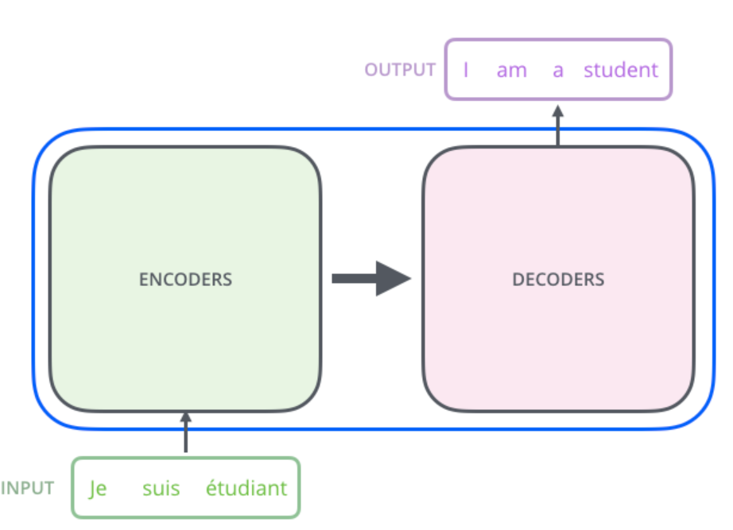
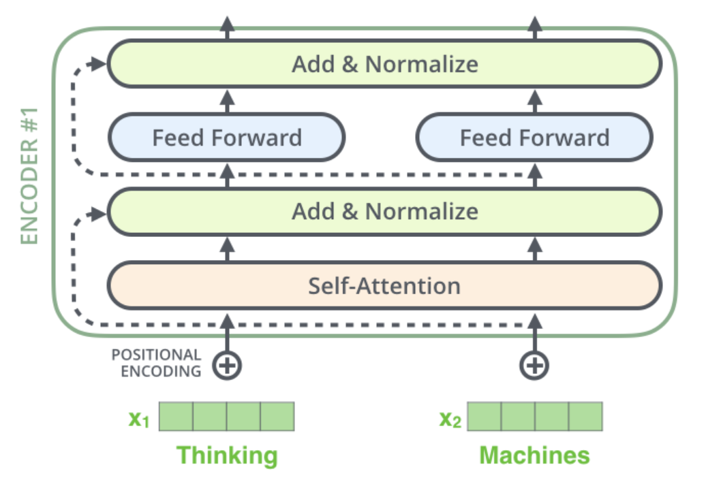
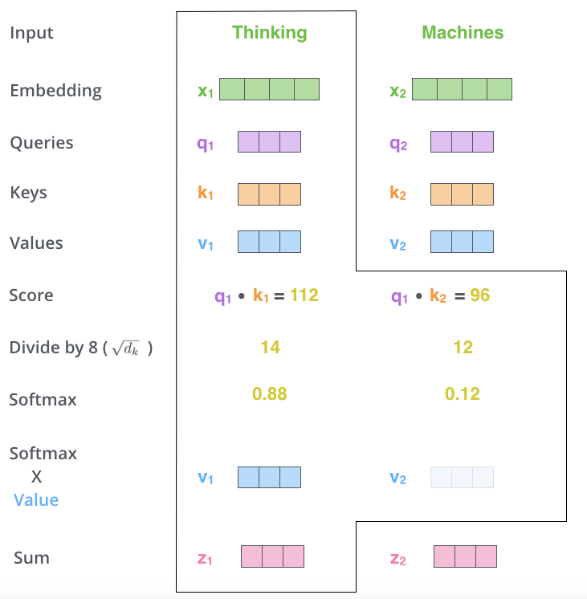
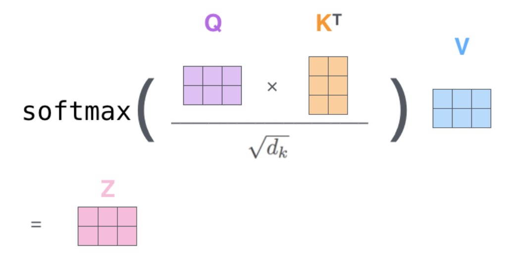

# Enhancing Large Language Models with Human Feedback via Reinforcement Learning : Report 

*Emma Bastien*

## Introduction

## 1. Understanding and Utilizing Transformers 

Transformer models have marked a turning point in machine learning, particularly in natural language processing (NLP). Introduced in Vaswani et al.’s seminal paper *Attention is All You Need​*
, Transformers diverge from traditional neural architectures by relying on self-attention mechanisms. This innovation eliminates the need for recurrent or convolutional networks, addressing their inefficiencies and unlocking a range of possibilities in sequence modeling.

### 1.1. Transformer models : Mathematical foundation and Architecture

(a) Encoder-Decoder Structure

The Transformer model consists of two main components: the encoder and the decoder, each constructed by stacking layers. The encoder processes the input sequence X (where each x_i is a vector representingg a word or token in the sequence) transforming it into a series of contextualized vector representations Z. These representations are then passed to the decoder, which generates the output sequence one token at a time. The two modules are connected via the attention mechanism, allowing the decoder to focus on relevant parts of the encoded input during generation.

Mathematically, the encoder-decoder structure can be expressed as:

$$
\mathbf{z} = \text{Encoder}(\mathbf{x}),
$$

where

$$
\mathbf{X} = [x_1, x_2, \dots, x_n]
$$

is the input sequence, and

$$
\mathbf{Z} = [z_1, z_2, \dots, z_n]
$$

is the sequence of encoded representations.

The decoder generates the output sequence

$$
\mathbf{y} = [y_1, y_2, \dots, y_m]
$$

autoregressively:

$$
\mathbf{y}_t = \text{Decoder}(\mathbf{y}_{<t}, \mathbf{z}),
$$

where

$$
\mathbf{y}_{<t}
$$

represents all tokens generated prior to t. 

#### *What happens in the Encoder?*

The encoder consists of N identical layers, each comprising three main components: a self-attention mechanism, a feed-forward neural network (FFN), and layer normalization with residual connections. Together, these components process the input sequence to produce a set of contextualized representations as follows : 

Let us now go into more details and investigate what happens in each one of the layers.

** (b) Self attention and multihead-attention**

The self-attention mechanism is the core operation of the encoder. It allows each token in the sequence to attend to every other token of the sequence, producing a weighted sum of the sequence's representations. 
The operation is crucial since it is the only one in the architecture that allows to learn information between vectors (ie. words).

The input sequence X made of embedded / preprocessed vectors goes in and a sequence of vectors goes out. 

How is this sequence Z computed ? 

Well, each input vector \( \mathbf{x}_i \) serves three distinct roles:

1. It is compared to all other vectors to determine the weights for its own output \( \mathbf{z}_i \).
2. It is compared to all other vectors to determine the weights for the output of another vector \( \mathbf{z}_j \).
3. It contributes to the weighted sum that calculates each output vector after the weights have been established.

These three roles are referred to as the **query**, the **key**, and the **value**. 
In the standard self-attention setup, each input vector is required to complete all three roles at the same time. 

To do so, first, from each input vector are created three vectors (Query, Key, Value). These vectors are computed by multiplying the embedded vectors by three matrices trained and defined as : 

\( k \times k \) weight matrices: \( \mathbf{W}_Q \), \( \mathbf{W}_K \), and \( \mathbf{W}_V \)
$$
\mathbf{Q}_i = \mathbf{W}_Q \mathbf{X}_i
$$

$$
\mathbf{K}_i = \mathbf{W}_K \mathbf{X}_i
$$

$$
\mathbf{V}_i = \mathbf{W}_ \mathbf{X}_i
$$

Once the query and key vectors are computed, they are used to calculate the attention scores. The attention weight \( w_{ij} \) between the \( i \)-th query and the \( j \)-th key is determined by the dot product of their vectors, followed by a division by the square root of the dimension of the key vectors and finally the application of a softmax function to normalize the weights:

$$
w'_{ij} = \mathbf{q}_i^\top \mathbf{k}_j
$$

This is the basic intuition behind self-attention. The dot product expresses how related two vectors of the input sequence are related and the output vectors are weighted sums over the whole input sequence (with the weights being determined by these dot products).

$$
w_{ij} = \text{softmax}(w'_{ij})
$$

Finally, the output vector \( \mathbf{z}_i \) is computed as a weighted sum of the value vectors \( \mathbf{v}_j \) multiplied by the softmax scores \( w_{ij} \):
The idea if to keep intact the values of the words relevant and left-out the most irrelevant ones. 

$$
\mathbf{z}_i = \sum_j w_{ij} \mathbf{v}_j
$$

Everything is summarized in a comprehensible way below, for instance for the first word x1 : 

In higher dimension and with matrix computation, we thus have as general formula to compute the outputs of the self-attention layer:

MULTI HEAD

** (c) Positional Encoding** 

** (d) Feedforward NN**

** (e) Layer-normalization steps / Scaling**

#### *What happens in the Decoder?* 

Same components as in the encoder

"encoder-decoder" attention 

Final Linear and Softmax Layer 

#### Summary of a Transformers' model architecture

Ref
- attention is all you need
- HF transformers doc + TP 
- Jay Allammar's Visual Guide to Transformers 
- Peter Bloem : transformers from scratch 

### 1.2. Causal Transformers : Concept and Training Methodologies

Causal Masking

Training Objective

Architectures : GPT and LLaMA -> focus on GPT

Challenges and solutions 

Optimization Techniques 

## 2. Reinforcement Learning with Human Feedback 

### 2.1. How does it works ? 

Overview of RLHF

Key steps

Applications 

Advantages and Challenges 

Specific context of LLMs

### 2.2. Training a Reward Model : implementation in practice 

Documentation and analysis of the training process 
https://huggingface.co/docs/trl/dataset_formats#preference -> choice of the dataset

RewardTrainer : Preference (implicit prompt recommended)

The [RewardTrainer] requires a implicit prompt preference dataset. It means that the dataset should only contain the columns "chosen" and "rejected" (and not "prompt"). The [RewardTrainer] supports both conversational and standard dataset format. When provided with a conversational dataset, the trainer will automatically apply the chat template to the dataset.

You can also use a pretokenized dataset, in which case the dataset should contain the following columns: input_ids_chosen, attention_mask_chosen, input_ids_rejected and attention_mask_rejected.v

After preparing your dataset, you can use the [RewardTrainer] in the same way as the Trainer class from 🤗 Transformers. You should pass an AutoModelForSequenceClassification model to the [RewardTrainer], along with a [RewardConfig] which configures the hyperparameters of the training.

https://github.com/huggingface/trl/tree/main

Dataset Collection 

Reward Model architecture 

Training process (loss functions used, evaluation metrics...)

Importance of robust evaluation 

Common pitfalls like overfitting to the reward model 

conclusion : can be improved / optimized : link to PPO

## 3. Optimization with Proximal Policy Optimization (PPO)

What is PPO (quickly)?

Generation of the sample output from the optimized model to demonstrate its capabilities

PPO FAQ Training :

Mean Reward: The primary goal is to maximize the reward achieved by the model during RL training. Objective KL Divergence: KL divergence 
(Kullback-Leibler divergence) measures the dissimilarity between two probability distributions. In the context of RL training, we use it 
to quantify the difference between the current model and a reference model. Ideally, we want to keep the KL divergence between 0 and 10 to 
ensure the model’s generated text remains close to what the reference model produces.

