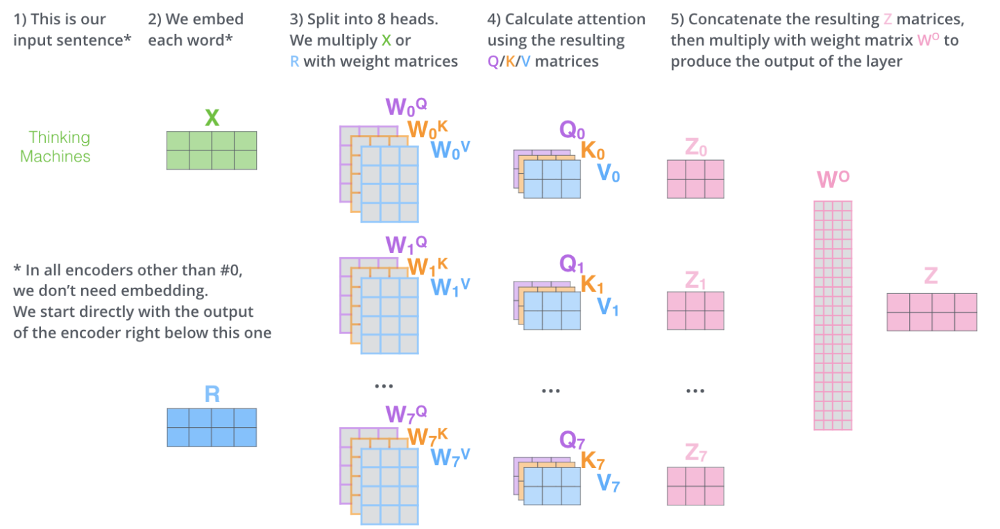
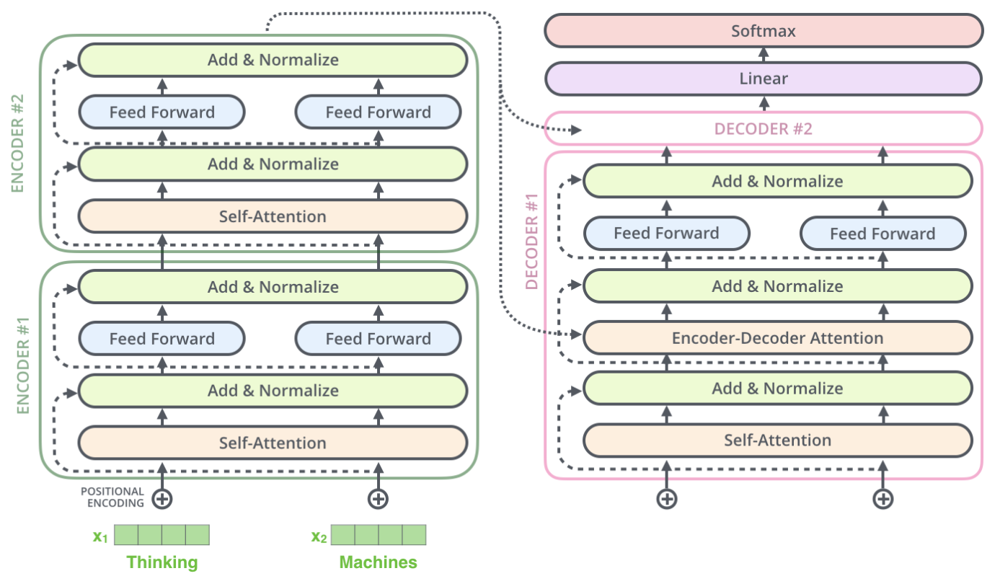
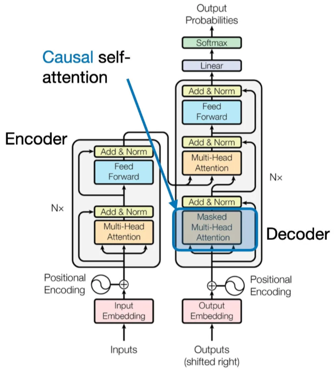
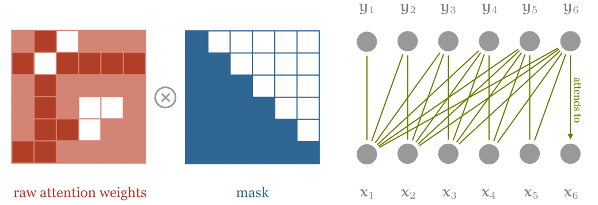
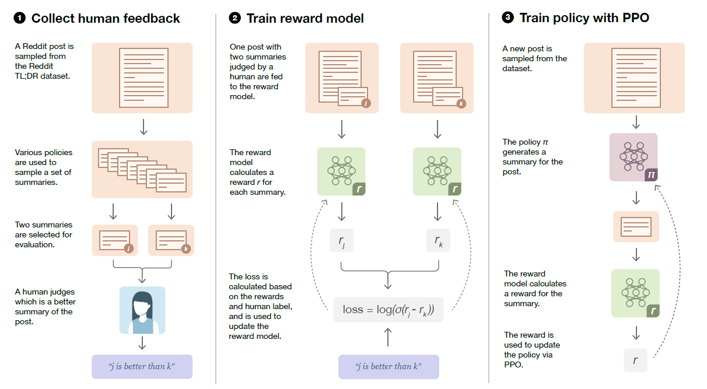
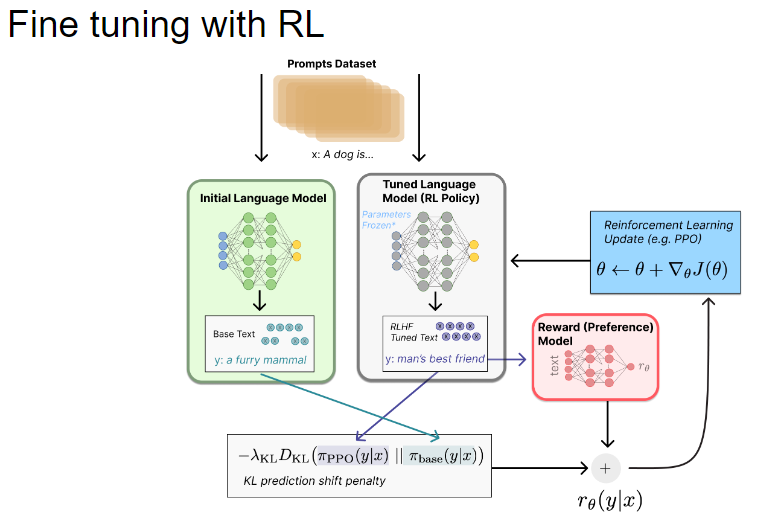

# Enhancing Large Language Models with Human Feedback via Reinforcement Learning : Report 

*Emma Bastien*
## Introduction 

## 1. Understanding and Utilizing Transformers 

Transformer models have marked a turning point in machine learning, particularly in natural language processing (NLP). Introduced in Vaswani et al.’s seminal paper *Attention is All You Need​*
, Transformers diverge from traditional neural architectures by relying on self-attention mechanisms. This innovation eliminates the need for recurrent or convolutional networks, addressing their inefficiencies and unlocking a range of possibilities in sequence modeling.

### 1.1. Transformer models : Mathematical foundation and Architecture

*NB:*
All the illustrations in the following part come from *The Illustrated Transformer* written by Jay Alammar (2018).

**(a) Encoder-Decoder Structure**

The Transformer model consists of two main components: the encoder and the decoder, each constructed by stacking layers. The encoder processes the input sequence X (where each x_i is a vector representing a word or token in the sequence) transforming it into a series of contextualized vector representations Z. These representations are then passed to the decoder, which generates the output sequence one token at a time. The two modules are connected via the attention mechanism, allowing the decoder to focus on relevant parts of the encoded input during generation.

Mathematically, the encoder-decoder structure can be expressed as:

$$
\mathbf{z} = \text{Encoder}(\mathbf{x}),
$$

where

$$
\mathbf{X} = [x_1, x_2, \dots, x_n]
$$

is the input sequence, and

$$
\mathbf{Z} = [z_1, z_2, \dots, z_n]
$$

is the sequence of encoded representations.

The decoder generates the output sequence

$$
\mathbf{y} = [y_1, y_2, \dots, y_m]
$$

#### *What happens in the Encoder?*

The encoder consists of layers, each comprising three main components: a self-attention mechanism, a feed-forward neural network (FFN), and layer normalization with residual connections. Together, these components process the input sequence to produce a set of contextualized representations as follows : 

Let us now go into more details and investigate what happens in each one of the layers.

**(b) Self attention and multihead-attention**

The self-attention mechanism is the core operation of the encoder. It allows each token in the sequence to attend to every other token of the sequence, producing a weighted sum of the sequence's representations. 
The operation is crucial since it is the only one in the architecture that allows to learn information between vectors (ie. words).

The input sequence X made of embedded / preprocessed vectors goes in and a sequence of vectors Z goes out. 

How is this sequence Z computed ? 

Well, each input vector $\mathbf{x}_i$ serves three distinct roles:

1. It is compared to all other vectors to determine the weights for its own output \[ \mathbf{z}_i \].
2. It is compared to all other vectors to determine the weights for the output of another vector \[ \mathbf{z}_j \].
3. It contributes to the weighted sum that calculates each output vector after the weights have been established.

These three roles are referred to as the **query**, the **key**, and the **value**. 
In the standard self-attention setup, each input vector is required to complete all three roles at the same time. 

To do so, first, from each input vector are created three vectors (Query, Key, Value). These vectors are computed by multiplying the embedded vectors by three matrices trained and defined as : 

Weight matrices: \[ \mathbf{W}_Q \], \[ \mathbf{W}_K \], and \[ \mathbf{W}_V \]

$$
\mathbf{Q}_i = \mathbf{W}_Q \mathbf{X}_i
$$

$$
\mathbf{K}_i = \mathbf{W}_K \mathbf{X}_i
$$

$$
\mathbf{V}_i = \mathbf{W}_V \mathbf{X}_i
$$

Once the query and key vectors are computed, they are used to calculate the attention scores. The attention weight w_ij between the \( i \)-th query and the \( j \)-th key is determined by the dot product of their vectors, followed by a division by the square root of the dimension of the key vectors and finally the application of a softmax function to normalize the weights:

$$
w'_{ij} = \mathbf{q}_i^\top \mathbf{k}_j
$$

This is the basic intuition behind self-attention. The dot product expresses how related two vectors of the input sequence are related and the output vectors are weighted sums over the whole input sequence (with the weights being determined by these dot products).

$$
w_{ij} = \text{softmax}(w'_{ij})
$$

Finally, the output vector \[ \mathbf{z}_i \] is computed as a weighted sum of the value vectors \[ \mathbf{v}_j \] multiplied by the softmax scores \[ \mathbf{w}_{ij} \]:
The idea if to keep intact the values of the words relevant and left-out the most irrelevant ones. 

$$ 
\mathbf{z}_i = \sum_j w_{ij} \mathbf{v}_j 
$$

Everything is summarized in a comprehensible way below, for instance for the first word x1 : 

In higher dimension and with matrix computation, we thus have as general formula to compute the outputs of the self-attention layer:

Finally, in order to account for the model's ability to focus on different positions and that a word can have different meanings, Transformers models' actually use not a single-layer of self-attention as mentionned above but a **multi-head attention**. 
It consists in several self-attention mechanisms that are applied in parallel. Each self-attention mechanism has its own key, value and query parameters. 
More especially, according to Alammar (2018), a Transformer uses 8 attention heads (ie. we have 8 randomly initialized sets for each encoder and decoder). 

However, since the Feedforward layer, coming after the multi-head attention one, does not expect 8 different inputs, a final step of the multi-head attention mechanism is to multiply the concatenated matrices by a final weight matrix that was trained, as it was done in this illustration : 

**(c) Positional Encoding** 

Additionnally, Transformers also take into account the order of the words in the imput sequence X. Indeed, depending on the order of the words, the sequences coudl have a very different meaning. It is thus important to add an additionnal element to account for this. 
Do to so, the Transformers add an additionnal vector to each input embedded word x1, ... xn called position encodings. 
Positional encoding allows to introduce sequential information in the inputs. 

**(d) Layer Normalization and Residual Connections**

Finally, before and after going into the Feed Forward NN layer, our inputs go through a "Layer Normalization and Residual Connection Step" ("Add and Normalize" layer).
This consists in adding the input of each sub-layer to its output and apply normalization to ensure numerical stability and faster convergence : 

$$
\text{Output} = \text{LayerNorm}(x + \text{Sublayer}(x))
$$

Where:
- x is the input to the layer.
- Sublayer(x) represents the operation performed within the sublayer (e.g., attention or feedforward network).
- LayerNorm is the layer normalization applied to the sum of the input and sublayer output.

#### *What happens in the Decoder?* 
Now that we have investigated in details what were the differents layers and their purpose in the encoder, let us now focus on the events of the decoder. 
Here is its structure : 

So, as showed above, globally the decoder mirrors the encoder's structure but includes additional components to enable the generation of the output sequence.

Similarly to the encoder, the decoder employs self-attention. It can also include a masking mechanism that prevents attending to future tokens (setting them to a value of -infinity). 
Also, the first attention layer of the decoder is specific and called the "Encoder-Decoder" attention. It allows the decoder to decode the encoder's output representations by taking the Keys and Values matrix from the outputs of the encoder. 

Finally, after going through several layers of multi-head attentions, FFNN and Layer Normalization, the decoder stacks outputs a final vector of floats that needs to be turned back into words. 
This final step is implemented through a Linear Layer followed by a Softmax one. 

The linear layer maps the representations to the dimensionality of the target vocabulary, which are called logits vectors. Finally, a softmax function converts these vectors into probabilities (all positive and adding to 1) for each word in the vocabulary, enabling the model to predict the most likely word at each step.
Finally, the cell with the highest probability is chosen and its associated word is added to the final words output. 

##### References for this part:
- Vaswani et al. 2017. “Attention Is All You Need.” Advances in Neural Information Processing Systems 30: 5998–6008. https://arxiv.org/abs/1706.03762.

- Alammar. 2018. “The Illustrated Transformer.” Blog post http://jalammar.github.io/illustrated-transformer/.

- Bloem. 2019. “Transformers from Scratch.” Blog post https://peterbloem.nl/blog/transformers.

### 1.2. Causal Transformers : Concept and Training Methodologies

Causal transformers are a specialized class of transformer architectures designed for autoregressive tasks, where the prediction of each token depends only on its previous context. Unlike bidirectional models, which take the entire input sequence for contextual representation, causal transformers adopt a unidirectional approach, ensuring that future tokens do not influence current predictions.
This characteristic makes causal transformers particularly effective for generative tasks such as text generation or conversational modeling.
Their architecture typically employs causal masking in the self-attention mechanism.
An example of Causal Transformer is the Generative Pre-trained Transformer (GPT). In the following parts, we are going to focus on its architecture and training methodology as well as implementing it.

**(a) Causal Masking**

The main difference with the Transformer structure presented above relies in the first layer of attention in the decoder that is called "Causal Self-Attention" or "Masked Self-Attention" : 

This causal mask ensures that during the prediction of a token at any position t, only information from preceding tokens t-1, t-2, ..., 1 is used
This is achieved by applying a triangular masking matrix to the attention scores, effectively blocking any future information into the present prediction.
It is also more efficient due to the fact that it saves time on doing unnecessary computations for the masked positions. 
In the context of GPT-like LLMs, future tokens are thus masked out for each token of the input set as follows: 

So, by implementing causal self-attention, we ensure the generation of text by our language model from left-to-right, by taking into account only the previous context of a sentence to predict new words, which is really important to get sentences that have a sense.

**(b) GPT Architecture and Training Methodology**

*GPT Architecture*

The Generative Pre-trained Transformer (GPT) is a decoder-only transformer architecture designed for autoregressive tasks. Its structure, based on the transformer one, is made to generate text by predicting the next token in a sequence based on prior context. Here is its key structure:

1) Stacked Transformer Decoder Layers

- Multi-Head Self-Attention with **Causal Masking Layers** 

- Feedforward Neural Networks (FFNN) Layers

- Residual Connections and Layer Normalization

2) Positional Embeddings based on Transformer structure

3) Output Layer:
The output of GPT is passed through a linear transformation followed by a softmax layer, producing probabilities over the vocabulary for the next token prediction, like in the general Transformer structure.

*GPT Training Methodology*

GPT’s training methodology revolves around self-supervised learning. 
Self-supervised learning eliminates the need for manually labeled datasets by using the structure of the input data itself as the supervision signal.

The training objective for causal transformers is based on minimizing the negative log-likelihood (NLL) of the target sequence given the preceding context.
More precisely, GPT is trained to predict the next token in a sequence, maximizing the conditional probability.

After training, GPT can be fine-tuned for specific tasks and to make it scalable and cost-effective. Indeed, we will see later on in the implementation that cost-efficiency will be indeed most crucial.

##### References for this part:

- Hugging Face. "Language Modeling." Transformers Documentation. Last modified December 28, 2024. https://huggingface.co/docs/transformers/en/tasks/language_modeling?utm_source=chatgpt.com.

- Hugging Face. "Chapter 7, Section 6: Causal Language Modeling." Hugging Face NLP Course. Last modified December 28, 2024. https://huggingface.co/learn/nlp-course/en/chapter7/6?utm_source=chatgpt.com.

- Kashyap, Tejaswi.2021. "Unpacking Attention in Transformers: From Self-Attention to Causal Self-Attention." Medium https://medium.com/@tejaswi_kashyap/unpacking-attention-in-transformers-from-self-attention-to-causal-self-attention-21fa6824acd8.

## 2. Reinforcement Learning with Human Feedback 

### 2.1. How does it works ? 

*Overview of RLHF*

Reinforcement Learning with Human Feedback (RLHF) is an approach that improves models by integrating human preferences into the training process. Unlike traditional reinforcement learning, which depends on explicit reward signals based on predefined rules, RLHF uses human feedback to align models with desired behaviors. This method helps ensure that the model's outputs are more relevant with human values.

RLHF is especially valuable in NLP and large language models (LLMs). By incorporating human feedback, LLMs can better interpret complex instructions and generate more accurate content.

**Key steps of RLHF**

1. Initial Model Training

A large language model is pre-trained on a dataset using supervised learning techniques. This forms the base model, which has general knowledge and the ability to generate coherent text.

2. Collection of Human Feedback:

Human evaluators provide feedback on the model’s outputs. This feedback is used to create a **Reward Model**.

3. Training of the Reward Model:

The reward model is trained to predict human preferences based on the collected feedback. This model assigns a reward score to outputs, estimating how closely they align with human evaluations.

4. Fine-tuning with Reinforcement Learning:

Using Reinforcement Learning, the base model is fine-tuned to optimize for the reward model’s score. A common algorithm employed in this stage is Proximal Policy Optimization (PPO).

These steps are illustrated below by the Early OpenAI experiments with RLHF : 

**Advantages and Challenges** \\
RLHF offers several benefits, especially in the **context of LLMs**. First, it improves alignment with human intentions and ethical guidelines, ensuring that models behave in ways that reflect human values and also ethics.
It also helps produce higher-quality outputs by generating responses that are more accurate and relevant to the task at hand. Additionally, RLHF is adaptable, allowing models to be customized for specific applications and user preferences. This makes it easier to fine-tune models to meet the needs of different user.

However, RLHF comes with some challenges. One major issue is scalability. Using human feedback can be time-consuming and very costly, which can make it difficult to apply on a large scale. Indeed, RLHF can be demanding in terms of resources, as it needs computational power for training the reward model, collecting human feedback, and fine-tuning the language model.
ALso, bias is another concern since human feedback can be influenced by subjective opinions and affect the fairness of the results.

### 2.2. Training a Reward Model and Optimization with Proximal Policy Optimization (PPO): implementation in practice 

*Overview* \\
Following the same approach as Christiano et al. (2020), we began by selecting a dataset of human preferences for pairs of summaries, the *tiny-ultrafeedback-binarized dataset* from the trl library (Hugging Face). 
Next, we trained a reward model (RM) to predict which summary is preferred by humans ("chosen" vs "rejected" and their associated scores). To do so, we used a pretrained **GPT-2 model**. 
Finally, we employed reinforcement learning (RL) to train a policy (Proximal Policy Optimization, PPO) to maximize the score provided by the reward model as well as generating sample outputs from this optimized model to test its capabilities. 

**(a) Preprocessing of the dataset : Tokenization**

In this part, the task was to preprocess our dataset with the goal of training a reward model using the RewardTrainer from Hugging Face's transformers and trl libraries. 
The goal was thus to prepare the dataset in a format compatible with the requirements of the reward model, particularly by tokenizing the "chosen" and "rejected" texts.

Indeed, the Hugging Face documentation on dataset formats informed us that the RewardTrainer requires an implicit prompt preference dataset. It means that the dataset should only contain the columns "chosen" and "rejected" (and not "prompt") and that a pretokenized dataset should contain the columns "input_ids_chosen", "attention_mask_chosen", "input_ids_rejected" and "attention_mask_rejected". 

Thus,  we decided to tokenize the dataset with the function *tokenize* that processed each pair of texts, transforming them into a format that the reward model can use. Specifically, the function uses a tokenizer to convert both the "chosen" and "rejected" texts into token IDs and attention masks. 
This preprocessing ensures that the texts were properly formatted for training.

Additionally, as part of preprocessing, we selected a subset of the training dataset for the Reward Model (RM) training to optimize memory usage and computational efficiency. 

**(b) Configuration of the training parameters of the Reward Model**

The training parameters for the Reward Model were chosen to balance efficiency and performance. 
We chose a batch size of 8 to optimize memory usage while processing multiple examples. 
The training was set for 1 epoch to minimize computational load, with a small learning rate of 1.0e-5 to ensure stable learning. 
Frequent progress updates were enabled with logging_steps set to 25, and evaluation occurs every 50 steps (eval_steps=50) to monitor performance without slowing training. 
Finally, parallel data processing was implemented (dataset_num_proc=4) to speed up training.

**(c) Training and results / assessment**

In our results, the columns "chosen_text" and "rejected_text" represent the two different summary options that have been compared and evaluated based on human preferences. The "logits" column we obtained after training the model shows the prediction probabilities or logits (e.g., [0.4218, 0.5782]) indicating which summary is preferred by the humans. 
Thus, the "chosen_text" and "rejected_text" are used as pairs of summaries with associated human feedback, and the logits represent the model's predicted preference score. 

The training results indicate that the Reward Model is making progress, but there's room for improvement, particularly in terms of accuracy. The results from step 50 show a training loss of 0.82, validation loss of 0.69, and an accuracy of 0.51, suggesting that the model is still in the early stages of learning and is not yet effectively differentiating between the "chosen" and "rejected" texts.

Looking at the subset of our dataset, it consists of 1,242 training points and 1,000 testing points, which is a relatively small amount for training a robust reward model. The model’s performance could likely improve with a larger dataset, by including more diverse examples of "chosen" and "rejected" text pairs. The limited dataset might be causing the model to struggle in distinguishing differences between texts, as proved by the low accuracy and high loss. 
If computational resources (e.g., CUDA memory) were not a constraint, adding more examples could help the model perform better. Also, we only consider here 1 training epoch, which might not be sufficient. 

**(b) Optimization with Proximal Policy Optimization (PPO) or Fine Tuning with RL**

Finally, we wanted to use the reward model to train a policy that generates higher-quality outputs, as evaluated by humans. This is done using reinforcement learning, where the reward model's output serves as the feedback for the generated summary. The goal is to optimize the policy to maximize this reward using the PPO algorithm.

PPO is effective because it refines the language model over time based on feedback from the reward model, which acts as the environment. The reward model evaluates the model’s outputs and assigns a score that reflects their quality. This feedback helps guide the policy to generate better outputs with each iteration.

We started with an initial language model that generates basic responses. Using Reinforcement Learning from Human Feedback (RLHF), we fine-tuned the model to align its outputs with human preferences. PPO played a key role by maximizing the reward while also ensuring stability. PPO achieves this by applying a penalty that limits how much the policy can change, using KL divergence to control the updates and prevent drastic changes.

All in all, we followed the approach explained in the RLHF lecture from Stanford as follows : 

In addition, during training, we wanted to measure two metrics, as adviced in Hugging Face documentation "PPO FAQ Training", the **Mean Reward** and **KL Divergence**. 
The Mean Reward would have helped tracking the average reward received by the model, with the aim of increasing it to improve the quality of generated outputs. 
KL Divergence would have measured the difference between the current and reference policies, ensuring that the model's output stays close to the behavior of the reference model.

However, due to CUDA memory limitations and lack of GPU resources, we could not fully compute and track these metrics during training.

In future work, scaling up our computational resources would hence be essential to enable more effective optimization of the policy with PPO.

##### References for this part (including for the implementation) : 

- Christiano et al. 2020. "Deep Reinforcement Learning from Human Preferences." Proceedings of NeurIPS 
https://proceedings.neurips.cc/paper_files/paper/2020/file/1f89885d556929e98d3ef9b86448f951-Paper.pdf.

- CleanRL. "PPO Implementation in PyTorch." CleanRL GitHub.
https://github.com/vwxyzjn/cleanrl/tree/master.

- Hugging Face. "Reward Modeling Example." Hugging Face GitHub. 
https://github.com/huggingface/trl/blob/main/examples/scripts/reward_modeling.py.

- Hugging Face. "TRL GitHub Repository." Hugging Face GitHub.
 https://github.com/huggingface/trl/tree/main.

- Hugging Face. "TRL Quickstart: Minimal Example." Hugging Face Documentation. 
https://huggingface.co/docs/trl/quickstart#minimal-example.

- Hugging Face. "TRL Dataset Formats: Preference." Hugging Face Documentation. 
 https://huggingface.co/docs/trl/dataset_formats#preference.

- Hugging Face. "How to Train Models Using TRL." Hugging Face Documentation. 
 https://huggingface.co/docs/trl/how_to_train.

- OpenAI. 2022. "Learning to Summarize with Human Feedback." arXiv. 
https://arxiv.org/abs/2203.02155.

- Schulman et al. 2017. "Proximal Policy Optimization Algorithms." arXiv. 
https://arxiv.org/abs/1707.06347.

- Stanford University. 2024. "RLHF Lecture."
 https://t.co/Uk8g6mBTrD.

